# Chapter 1: C++语言

本章学习C++语言的一部分基本知识，学习本章后就能满足算法竞赛的大部分需求。

---


## C++基本知识

本节讲述C++语言的历史和一些基本知识，希望读者阅读后能对C++有一个简单的认识。


程序创建的步骤：

1. 编写源代码
2. 编译源代码
3. 链接程序


编写你的第一个程序：`hello.cpp`

```c++
// hello.cpp
#include <cstdio> // 使用cstdio库

using namespace std; // 使用命名空间std

int main() { // main函数，程序入口
	printf("Hello world");
	return 0;
}
```

下面简单地解释一下这个程序。

### main函数

去掉修饰后，程序的基本结构如下：

```c++
int main() {
    // statements
    return 0;
}
```

这几行表明了一个名为`main()`的函数，并描述了该函数的行为。这几行代码构成了函数定义，该定义由两部分组成：

- `int main()` 叫做**函数头**，函数头对函数与程序其他部分之间的接口进行了定义；
- 花括号中包括的部分叫做**函数体**，描述了该函数执行什么计算机指令。

在C++中，每条完整的指令都称为语句，所有的语句都以分号结束。

> 语句是执行的操作，为了理解代码，编译器需要知道每一条语句什么时候结束、另一条语句什么时候开始。像C++这样的语言使用显式的终止符，终止符是一个分号，它是语句的结束标记。在C++中，不能省略分号。

> 为什么`main()`不能使用其他名称？
>
> 通常，C++程序必须包含一个名为`main()`的函数，这是操作系统与程序的接口，也是程序的入口。


### C++注释

C++注释以双斜杠（//）打头，到行尾结束。

```c++
// This is a comment
```


注释是程序员为读者提供的说明，编译器忽略注释。


也可以使用C语言风格的注释：

```c++
/* a C-style comment */
```

由于C风格的注释以*/结束，所以可以跨越多行。


### 头文件

像`cstdio`这样的文件叫做**包含文件**，由于被包含在文件的起始处，也叫做**头文件**。C++编译器自带了很多头文件，每个头文件都定义了一组特定的工具。

例如在`hello.cpp`中，`printf`这个函数就是在`cstdio`中定义的。


### 名称空间

`using namespace std;`这句话表示使用名为`std`的命名空间。

读者完全不需要知道这句话的含义，只需要接受它就行了，不要忘记写它，不然你可能会编译失败：`error: 'xxx' was not declared in this scope`。

具体的原因和用途，有兴趣的读者可以自己去学习与了解，本书不去讨论。


下面再来看一个程序：`example2.cpp`

```c++
// example2.cpp
#include<cstdio>
#include<cmath>
using namespace std;

int main() {
    double a, b, c;
    a = 3;
    b = 4;
    c = sqrt(a * a + b * b);
    printf("a = %lf, b = %lf, c = %lf", a, b, c);
    return 0;
}
```


### 变量声明与赋值

C++程序是一组函数，而每个函数又是一组语句。C++有好几种语句，其中最基础就是变量声明与赋值。**C++语言要求：使用变量前必须声明它。**

在`example2.cpp`中的第七行`double a, b, c;`就是一条变量声明语句，它声明了三个类型为`double`的变量`a, b, c`。第八、九、十行都是变量赋值语句，`=`就是C++中的赋值运算符。

> `example2.cpp`的第十行中的`sqrt()`函数是在`cmath`这个头文件中定义的，是平方根计算函数。


### 输入输出

在`hello.cpp`的第七行和`example2.cpp`的第十一行，都有一个`printf`的函数，这是在`cstdio`中定义的一个格式化输出的函数，关于这个函数的更多细节，将在未来的章节中介绍。


目前为止已经简单的介绍了C++语言中的一些基本组成部分，接下来的章节将详细地讨论。


---


## 变量与类型

什么是变量？如何理解一个变量？

程序通常需要存储信息，为了存储信息，程序必须记录三种基本属性：

1. 信息存储在哪里；
2. 要存储什么值；
3. 存储什么类型的信息。

变量就是同时包含这三种基本属性的存在。


### 变量声明

变量声明的格式为：`type name1, name2, ...;` 。

例如：

```c++
int a;
double b, c;
```

也可以在声明变量的同时对其进行初始化：`type name1 = value1, name2 = value2, ...;`。

例如：

```c++
int a = 0;
double b = 1.0;
double c = b; // 使用变量b对c进行初始化
```


### 变量名

C++的变量名在遵守命名规则的前提下可以任意命名：

- 名称只能使用字母、数字和下划线（_）。
- 名称的第一个字符不能使数字。
- C++严格区分大小写字符。
- 不能将C++关键字用作名称。
- 以两个下划线或下划线和大写字母打头的名称被保留给实现（编译器及其使用的资源）使用。以一个下划线开头的名称被保留给实现，用作全局标识符。
- C++对于名称的长度没有限制，但有些平台有长度限制。

其中倒数第二点，使用`_time_stop`或`_Donut`这样的名称不会导致编译器错误，但是可能导致行为的不确定性，这样的名称是合法的，但要留给编译器实现使用。

下面是一些有效的和无效的C++名称：

```c++
int poodle;		// valid
int Poodle;		// valid and distinct from poodle
int POODLE;		// valid and even more distinct
Int terrier;	// invalid -- has to be int, not Int
int my_stars5;	// valid
int 4ever;		// invalid -- because starts with a digit
int double;		// invalid -- double is a C++ keyword
int begin;		// valid
int the_very_best_variable_i_can_be_version_112; // valid
int honky-tonk;	// invalid -- no hyphens allowed
```


### 变量类型

在计算机底层是没有类型的，数据都是以位（bit）为单位存储的，每一位要么是0要么是1。下面是各种常见单位的转换关系：

| 1 Byte | $2^3(8)$ bit        |
| ------ | ------------------- |
| 1 KB   | $2^{10}(1024)$ Byte |
| 1 MB   | $2^{10}(1024)$ KB   |
| 1 GB   | $2^{10}(1024)$ MB   |

早期的编程（汇编语言）都是直接对字节（Byte）进行操作的，但是这样效率太低，抽象层次太低。于是便有了类型系统。下面是C++常见类型：

| 类型               | 大小（字节） | 范围                                                         |
| ------------------ | ------------ | ------------------------------------------------------------ |
| char               | 1            | -128 到 127 或者 0 到 255                                    |
|                    |              |                                                              |
| int                | 4            | $-2^{31}\sim 2^{31}-1$                                       |
| unsigned int       | 4            | $0 \sim 2^{32} - 1$                                          |
| signed int         | 4            | $-2^{31}\sim 2^{31}-1$                                       |
| short int          | 2            | $-2^{15} \sim 2^{15} - 1$                                    |
| unsigned short int | 2            | $0 \sim 2^{16} - 1$                                          |
| signed short int   | 2            | $-2^{15} \sim 2^{15} - 1$                                    |
| long int           | 8            | $-2^{63} \sim 2^{63} - 1$                                    |
| signed long int    | 8            | $-2^{63} \sim 2^{63} - 1$                                    |
| unsigned long int  | 8            | $0 \sim 2^{64} - 1$                                          |
|                    |              |                                                              |
| float              | 4            | $-3.4\times 10^{38} \sim 3.4\times 10^{38}$ ($6\sim 7​$位有效数字) |
| double             | 8            | $-1.7\times 10^{308} \sim 1.7\times 10^{308}$ ($15\sim 16$位有效数字) |
|                    |              |                                                              |
| bool               | 1            | true or false                                                |


#### 数字类型

整形字面值：

| 进制   | 格式               | 示例        |
| ------ | ------------------ | ----------- |
| 10进制 | 第一位为$1 \sim 9$ | `42` = 42   |
| 8进制  | 第一位是`0`        | `042` = 34  |
| 16进制 | 前两位是`0x`或`0X` | `0x42` = 66 |


浮点数字面值：

1. 标准表示法：`12.34`、`-0.0023`、`+8.3`。
2. E表示法：`2.52e+8`、`-18.32E-12`。


整数在计算机中的存储：

首先要科普一下原码、反码和补码：

- 原码：
  - 正数：正数的原码是其二进制表示，前面补零。
  - 负数：负数的原码是其绝对值的原码，并且符号位置一。
- 反码：反码就是其原码各位取反。
- 补码：
  - 正数：正数的补码是其原码。
  - 负数：负数的补码是其反码加一。

**在计算机中，所有数字都是以其补码的形式存储的。**

你可能会奇怪，为什么要使用补码而不是原码，补码的意义是什么？

原码的好处是方便人类理解，但是由于人类加入的符号位，使得其计算变得复杂，符号位仿佛是不同的、特殊的；而且在原码中$0$的表示不是唯一的（$+0,-0$的表示不统一）：如果是$8$位表示一个数字，$+0$表示为`0000 0000`，而$-0$表示为`1000 0000`。

补码的本质是数字在模意义下的表示，所以计算变得简单统一。计算机中减法是用加法器实现的，由于补码的性质，$[X-Y]_{补} = X_{补} + [-Y]_{补}$。$0$的补码表示也是唯一的，拓宽了数字表示范围。

如果$8$位表示一个数字：

| 数字  | 原码        | 反码        | 补码        |
| ----- | ----------- | ----------- | ----------- |
| `+20` | `0001 0100` | `1110 1011` | `0001 0100` |
| `-20` | `1001 0100` | `0110 1011` | `0110 1100` |


#### 字符类型

字符类型`char`的本质就是一个Byte的数字，如何把这个数字翻译成对应的字符，就需要查询ASCII表：

| Bin(二进制) | Oct(八进制) | Dec(十进制) | Hex(十六进制) | 缩写/字符                   | 解释         |
| ----------- | ----------- | ----------- | ------------- | --------------------------- | ------------ |
| 0000 0000   | 00          | 0           | 0x00          | NUL(null)                   | 空字符       |
| 0000 0001   | 01          | 1           | 0x01          | SOH(start of headline)      | 标题开始     |
| 0000 0010   | 02          | 2           | 0x02          | STX (start of text)         | 正文开始     |
| 0000 0011   | 03          | 3           | 0x03          | ETX (end of text)           | 正文结束     |
| 0000 0100   | 04          | 4           | 0x04          | EOT (end of transmission)   | 传输结束     |
| 0000 0101   | 05          | 5           | 0x05          | ENQ (enquiry)               | 请求         |
| 0000 0110   | 06          | 6           | 0x06          | ACK (acknowledge)           | 收到通知     |
| 0000 0111   | 07          | 7           | 0x07          | BEL (bell)                  | 响铃         |
| 0000 1000   | 010         | 8           | 0x08          | BS (backspace)              | 退格         |
| 0000 1001   | 011         | 9           | 0x09          | HT (horizontal tab)         | 水平制表符   |
| 0000 1010   | 012         | 10          | 0x0A          | LF (NL line feed, new line) | 换行键       |
| 0000 1011   | 013         | 11          | 0x0B          | VT (vertical tab)           | 垂直制表符   |
| 0000 1100   | 014         | 12          | 0x0C          | FF (NP form feed, new page) | 换页键       |
| 0000 1101   | 015         | 13          | 0x0D          | CR (carriage return)        | 回车键       |
| 0000 1110   | 016         | 14          | 0x0E          | SO (shift out)              | 不用切换     |
| 0000 1111   | 017         | 15          | 0x0F          | SI (shift in)               | 启用切换     |
| 0001 0000   | 020         | 16          | 0x10          | DLE (data link escape)      | 数据链路转义 |
| 0001 0001   | 021         | 17          | 0x11          | DC1 (device control 1)      | 设备控制1    |
| 0001 0010   | 022         | 18          | 0x12          | DC2 (device control 2)      | 设备控制2    |
| 0001 0011   | 023         | 19          | 0x13          | DC3 (device control 3)      | 设备控制3    |
| 0001 0100   | 024         | 20          | 0x14          | DC4 (device control 4)      | 设备控制4    |
| 0001 0101   | 025         | 21          | 0x15          | NAK (negative acknowledge)  | 拒绝接收     |
| 0001 0110   | 026         | 22          | 0x16          | SYN (synchronous idle)      | 同步空闲     |
| 0001 0111   | 027         | 23          | 0x17          | ETB (end of trans. block)   | 结束传输块   |
| 0001 1000   | 030         | 24          | 0x18          | CAN (cancel)                | 取消         |
| 0001 1001   | 031         | 25          | 0x19          | EM (end of medium)          | 媒介结束     |
| 0001 1010   | 032         | 26          | 0x1A          | SUB (substitute)            | 代替         |
| 0001 1011   | 033         | 27          | 0x1B          | ESC (escape)                | 换码(溢出)   |
| 0001 1100   | 034         | 28          | 0x1C          | FS (file separator)         | 文件分隔符   |
| 0001 1101   | 035         | 29          | 0x1D          | GS (group separator)        | 分组符       |
| 0001 1110   | 036         | 30          | 0x1E          | RS (record separator)       | 记录分隔符   |
| 0001 1111   | 037         | 31          | 0x1F          | US (unit separator)         | 单元分隔符   |
| 0010 0000   | 040         | 32          | 0x20          | (space)                     | 空格         |
| 0010 0001   | 041         | 33          | 0x21          | !                           | 叹号         |
| 0010 0010   | 042         | 34          | 0x22          | "                           | 双引号       |
| 0010 0011   | 043         | 35          | 0x23          | #                           | 井号         |
| 0010 0100   | 044         | 36          | 0x24          | $                           | 美元符       |
| 0010 0101   | 045         | 37          | 0x25          | %                           | 百分号       |
| 0010 0110   | 046         | 38          | 0x26          | &                           | 和号         |
| 0010 0111   | 047         | 39          | 0x27          | '                           | 闭单引号     |
| 0010 1000   | 050         | 40          | 0x28          | (                           | 开括号       |
| 0010 1001   | 051         | 41          | 0x29          | )                           | 闭括号       |
| 0010 1010   | 052         | 42          | 0x2A          | *                           | 星号         |
| 0010 1011   | 053         | 43          | 0x2B          | +                           | 加号         |
| 0010 1100   | 054         | 44          | 0x2C          | ,                           | 逗号         |
| 0010 1101   | 055         | 45          | 0x2D          | -                           | 减号/破折号  |
| 0010 1110   | 056         | 46          | 0x2E          | .                           | 句号         |
| 0010 1111   | 057         | 47          | 0x2F          | /                           | 斜杠         |
| 0011 0000   | 060         | 48          | 0x30          | 0                           | 数字0        |
| 0011 0001   | 061         | 49          | 0x31          | 1                           | 数字1        |
| 0011 0010   | 062         | 50          | 0x32          | 2                           | 数字2        |
| 0011 0011   | 063         | 51          | 0x33          | 3                           | 数字3        |
| 0011 0100   | 064         | 52          | 0x34          | 4                           | 数字4        |
| 0011 0101   | 065         | 53          | 0x35          | 5                           | 数字5        |
| 0011 0110   | 066         | 54          | 0x36          | 6                           | 数字6        |
| 0011 0111   | 067         | 55          | 0x37          | 7                           | 数字7        |
| 0011 1000   | 070         | 56          | 0x38          | 8                           | 数字8        |
| 0011 1001   | 071         | 57          | 0x39          | 9                           | 数字9        |
| 0011 1010   | 072         | 58          | 0x3A          | :                           | 冒号         |
| 0011 1011   | 073         | 59          | 0x3B          | ;                           | 分号         |
| 0011 1100   | 074         | 60          | 0x3C          | <                           | 小于         |
| 0011 1101   | 075         | 61          | 0x3D          | =                           | 等号         |
| 0011 1110   | 076         | 62          | 0x3E          | >                           | 大于         |
| 0011 1111   | 077         | 63          | 0x3F          | ?                           | 问号         |
| 0100 0000   | 0100        | 64          | 0x40          | @                           | 电子邮件符号 |
| 0100 0001   | 0101        | 65          | 0x41          | A                           | 大写字母A    |
| 0100 0010   | 0102        | 66          | 0x42          | B                           | 大写字母B    |
| 0100 0011   | 0103        | 67          | 0x43          | C                           | 大写字母C    |
| 0100 0100   | 0104        | 68          | 0x44          | D                           | 大写字母D    |
| 0100 0101   | 0105        | 69          | 0x45          | E                           | 大写字母E    |
| 0100 0110   | 0106        | 70          | 0x46          | F                           | 大写字母F    |
| 0100 0111   | 0107        | 71          | 0x47          | G                           | 大写字母G    |
| 0100 1000   | 0110        | 72          | 0x48          | H                           | 大写字母H    |
| 0100 1001   | 0111        | 73          | 0x49          | I                           | 大写字母I    |
| 01001010    | 0112        | 74          | 0x4A          | J                           | 大写字母J    |
| 0100 1011   | 0113        | 75          | 0x4B          | K                           | 大写字母K    |
| 0100 1100   | 0114        | 76          | 0x4C          | L                           | 大写字母L    |
| 0100 1101   | 0115        | 77          | 0x4D          | M                           | 大写字母M    |
| 0100 1110   | 0116        | 78          | 0x4E          | N                           | 大写字母N    |
| 0100 1111   | 0117        | 79          | 0x4F          | O                           | 大写字母O    |
| 0101 0000   | 0120        | 80          | 0x50          | P                           | 大写字母P    |
| 0101 0001   | 0121        | 81          | 0x51          | Q                           | 大写字母Q    |
| 0101 0010   | 0122        | 82          | 0x52          | R                           | 大写字母R    |
| 0101 0011   | 0123        | 83          | 0x53          | S                           | 大写字母S    |
| 0101 0100   | 0124        | 84          | 0x54          | T                           | 大写字母T    |
| 0101 0101   | 0125        | 85          | 0x55          | U                           | 大写字母U    |
| 0101 0110   | 0126        | 86          | 0x56          | V                           | 大写字母V    |
| 0101 0111   | 0127        | 87          | 0x57          | W                           | 大写字母W    |
| 0101 1000   | 0130        | 88          | 0x58          | X                           | 大写字母X    |
| 0101 1001   | 0131        | 89          | 0x59          | Y                           | 大写字母Y    |
| 0101 1010   | 0132        | 90          | 0x5A          | Z                           | 大写字母Z    |
| 0101 1011   | 0133        | 91          | 0x5B          | [                           | 开方括号     |
| 0101 1100   | 0134        | 92          | 0x5C          | \                           | 反斜杠       |
| 0101 1101   | 0135        | 93          | 0x5D          | ]                           | 闭方括号     |
| 0101 1110   | 0136        | 94          | 0x5E          | ^                           | 脱字符       |
| 0101 1111   | 0137        | 95          | 0x5F          | _                           | 下划线       |
| 0110 0000   | 0140        | 96          | 0x60          | `                           | 开单引号     |
| 0110 0001   | 0141        | 97          | 0x61          | a                           | 小写字母a    |
| 0110 0010   | 0142        | 98          | 0x62          | b                           | 小写字母b    |
| 0110 0011   | 0143        | 99          | 0x63          | c                           | 小写字母c    |
| 0110 0100   | 0144        | 100         | 0x64          | d                           | 小写字母d    |
| 0110 0101   | 0145        | 101         | 0x65          | e                           | 小写字母e    |
| 0110 0110   | 0146        | 102         | 0x66          | f                           | 小写字母f    |
| 0110 0111   | 0147        | 103         | 0x67          | g                           | 小写字母g    |
| 0110 1000   | 0150        | 104         | 0x68          | h                           | 小写字母h    |
| 0110 1001   | 0151        | 105         | 0x69          | i                           | 小写字母i    |
| 0110 1010   | 0152        | 106         | 0x6A          | j                           | 小写字母j    |
| 0110 1011   | 0153        | 107         | 0x6B          | k                           | 小写字母k    |
| 0110 1100   | 0154        | 108         | 0x6C          | l                           | 小写字母l    |
| 0110 1101   | 0155        | 109         | 0x6D          | m                           | 小写字母m    |
| 0110 1110   | 0156        | 110         | 0x6E          | n                           | 小写字母n    |
| 0110 1111   | 0157        | 111         | 0x6F          | o                           | 小写字母o    |
| 0111 0000   | 0160        | 112         | 0x70          | p                           | 小写字母p    |
| 0111 0001   | 0161        | 113         | 0x71          | q                           | 小写字母q    |
| 0111 0010   | 0162        | 114         | 0x72          | r                           | 小写字母r    |
| 0111 0011   | 0163        | 115         | 0x73          | s                           | 小写字母s    |
| 0111 0100   | 0164        | 116         | 0x74          | t                           | 小写字母t    |
| 0111 0101   | 0165        | 117         | 0x75          | u                           | 小写字母u    |
| 0111 0110   | 0166        | 118         | 0x76          | v                           | 小写字母v    |
| 0111 0111   | 0167        | 119         | 0x77          | w                           | 小写字母w    |
| 0111 1000   | 0170        | 120         | 0x78          | x                           | 小写字母x    |
| 0111 1001   | 0171        | 121         | 0x79          | y                           | 小写字母y    |
| 0111 1010   | 0172        | 122         | 0x7A          | z                           | 小写字母z    |
| 0111 1011   | 0173        | 123         | 0x7B          | {                           | 开花括号     |
| 0111 1100   | 0174        | 124         | 0x7C          | \|                          | 垂线         |
| 0111 1101   | 0175        | 125         | 0x7D          | }                           | 闭花括号     |
| 0111 1110   | 0176        | 126         | 0x7E          | ~                           | 波浪号       |
| 0111 1111   | 0177        | 127         | 0x7F          | DEL (delete)                | 删除         |


字符与字符串：

在C++中，字符用一对单引号包含，例如：`'a'`。字符串用一对双引号包含，例如：`"Hello world"`。一定要区分`'a'`和`"a"`是不同的，前者是一个字符，后者是只包含一个字符的字符串。关于字符串的更多细节将在数组部分介绍。


#### 布尔类型

布尔类型本质也只是一个Byte的数字，C++内部定义了四个布尔类型的常量：`true`、`false`、`TRUE`、`FALSE`。实际上的实现类似于：

```c++
#define true 1
#define TRUE 1
#define false 0
#define FALSE 0
```

布尔类型的存在主要是为了实现逻辑操作，主要用于下一节要讲的选择结构。


### 算数运算符

介绍完了C++的基本数据类型，接下来介绍C++内置的一些算数运算符，C++的运算符可以分为以下几类：

- 算术运算符
- 关系运算符
- 逻辑运算符
- 位运算符
- 赋值运算符
- 杂项运算符

下面分别介绍这些运算符。


#### 算数运算符

假设起初`A = 10, B = 20`。

| 运算符 | 描述                             | 实例               |
| ------ | -------------------------------- | ------------------ |
| `+`    | 把两个操作数相加                 | `A + B` 将得到 30  |
| `-`    | 从第一个操作数中减去第二个操作数 | `A - B` 将得到 -10 |
| `*`    | 把两个操作数相乘                 | `A * B` 将得到 200 |
| `/`    | 分子除以分母                     | `B / A` 将得到 2   |
| `%`    | 取模运算符，整除后的余数         | `B % A` 将得到 0   |
| `++`   | 自增运算符，整数值增加 1         | `A++` 将得到 11    |
| `--`   | 自减运算符，整数值减少 1         | `A--` 将得到 9     |

注释：

1. `/`需要特别注意，因为C++不区分整除与浮点数除法，都是这一个运算符。

   - 当两个操作数都是整形，该运算为整除；
   - 当一个（或两个）操作数是浮点数，该运算为浮点数除法。

2. `/`的整除需要与其余的几种取整进行区分：

   - `int()`：直接舍弃小数部分，返回整数部分，结果为`int`类型。
   - `/`：效果与`int()`一样，二者都可以视为“向零取整”。
   - `double round  (double x)`：四舍五入。
   - `double floor (double x)`：向下取整。
   - `double ceil(double x)`：向上取整。
   - `double trunc (double x)`：向零取整。

   ```c++
   5 / 3			// 1
   5.0 / 3			// 1.66667
   int(5.0 / 3)	// 1
   round(5.0 / 3)	// 2.0
   floor(5.0 / 3)	// 1.0
   ceil(5.0 / 3)	// 2.0
   
   
   -5 / 3			// -1
   -5.0 / 3		// -1.66667
   int(-5.0 / 3)	// -1
   round(-5.0 / 3)	// -2.0
   floor(-5.0 / 3)	// -2.0
   ceil(-5.0 / 3)	// -1.0
   ```

3. `%`的运算是这么定义的：`x % y = x - y * (x / y)`。

4. `++`与`--`这两个运算符十分特殊，它们都有前置和后置两种形式，下面就`++`进行讲解（`--`同理）：

   - `++a`：`a`自增，返回自增后的结果；
   - `a++`：`a`自增，返回自增前的结果。

   前置与后置的区别就在于这个表达式的结果不同，可以近似地这么理解：

   ```c++
   int before(int &x) {
       x = x + 1;
       return x;
   }
   
   int after(int &x) {
       int tmp = x;
       x = x + 1;
       return tmp;
   }
   ```

   下面举一些例子帮助理解：

   ```c++
   int a = 0, b = 1;
   (b++) + (++a)	// 2
   a				// 1
   b				// 2
   ```

   使用这种运算能够用很短的代码实现很复杂的操作，但是可读性降低了不少，所以并不推荐。最好只在一些特殊的情景（循环中）使用。


#### 关系运算符

| 运算符 | 描述                                                         |
| ------ | ------------------------------------------------------------ |
| `==`   | 检查两个操作数的值是否相等，如果相等则条件为真。             |
| `!=`   | 检查两个操作数的值是否相等，如果不相等则条件为真。           |
| `>`    | 检查左操作数的值是否大于右操作数的值，如果是则条件为真。     |
| `<`    | 检查左操作数的值是否小于右操作数的值，如果是则条件为真。     |
| `>=`   | 检查左操作数的值是否大于或等于右操作数的值，如果是则条件为真。 |
| `<=`   | 检查左操作数的值是否小于或等于右操作数的值，如果是则条件为真。 |


#### 逻辑运算符

| 运算符 | 描述                                                         |
| ------ | ------------------------------------------------------------ |
| `&&`   | 逻辑与，如果两个操作数都非零，则条件为真。                   |
| `||`   | 逻辑或，如果两个操作数中有任意一个非零，则条件为真。         |
| `!`    | 逻辑非，用来逆转操作数的逻辑状态。如果条件为真，则结果为假。 |

注释：

1. 逻辑运算符是为了实现布尔运算而存在的，但不单单可以应用于布尔类型的运算，语法上允许应用于其他数据类型。

   例如`1.2 && -1`的结果是`true`。原因很简单，因为布尔类型本质上也是数字，只有零被解释为逻辑假，其他都被理解为逻辑真。

2. C++中的`&&`与`||`是短路运算。

   - `A && B`中，如果`A`表达式的值为假，`B`表达式不会被计算；
   - `A || B`中，如果`A`表达式的值为真，`B`表达式不会被计算。

   短路运算是为了提升效率而存在的，大多数情况下不会引起问题，但是如果`B`表达式是带有“副作用”的，那么就会出问题。例如：

   ```c++
   (a > 0) && (++b < 10)	// 如果a <= 0，那么b不会自增
   (c < 5) || f(d)			// 如果c < 5，那么不会执行f函数，f函数可能不是纯函数
   ```

3. 需要注意，C++中不能使用类似`A < B < C`这样的结构。

   这样写编译器并不会报错，由于`<`是从左到右结合的，编译器会理解为`(A < B) < C`，而不是`(A < B) && (B < C)`。


#### 位运算符

位运算是十分特殊的一类运算，它们是直接对二进制位进行的操作，调用的是逻辑最简单的汇编指令，所以位运算的效率是十分高的，在一些特殊的应用场景能够起到“神奇”的效果。读者将会在这本书的后续章节中学习到。

首先介绍一位的二进制运算：

| `p`  | `q`  | `p & q` | `p | q` | `p ^ q` |
| ---- | ---- | ------- | ------- | ------- |
| 0    | 0    | 0       | 0       | 0       |
| 0    | 1    | 0       | 1       | 1       |
| 1    | 1    | 1       | 1       | 0       |
| 1    | 0    | 0       | 1       | 1       |

所谓的“位运算”就是二进制表示的每一位都按照上述规则进行计算。

假设下表中 `A = 60, B = 13`，即 `A = 0011 1100, B = 0000 1101`。

| 运算符 | 描述              | 实例                                  |
| ------ | ----------------- | ------------------------------------- |
| `&`    | 二进制 AND 运算符 | `(A & B)` 将得到 12，即为 `0000 1100` |
| `|`    | 二进制 OR 运算符  | `(A | B)` 将得到 61，即为 `0011 1101` |
| `^`    | 二进制异或运算符  | `(A ^ B)` 将得到 49，即为 `0011 0001` |
| `~`    | 二进制取反运算符  | `~A` 将得到 -61，即为 `1100 0011`     |
| `<<`   | 二进制左移运算符  | `A << 2` 将得到 240，即为 `1111 0000` |
| `>>`   | 二进制右移运算符  | `A >> 2` 将得到 15，即为 `0000 1111`  |


位运算有很多很多性质，在这里简单介绍一些：

1. `^`异或运算本质就是二进制加法；
2. `^`运算的逆运算就是其本身：
   - 单位元是`0`；
   - 对于任意`x`，`x ^ 0` 等于`x`；
   - 对于任意`x`，`x ^ x` 等于`0`；
   - 异或运算满足交换率与结合率。
3. `a << n`等价于$a \times 2^n$；
4. `a >> n`等价于$a \div 2^n$。

更多的性质，在后续章节应用到的时候讲解。


#### 赋值运算符

由最基本的`=`赋值运算符和其他双目运算符复合而成：

| 运算符 | 效果                                  |
| ------ | ------------------------------------- |
| `=`    | `C = A + B` 将把 `A + B` 的值赋给 `C` |
| `+=`   | `C += A` 相当于 `C = C + A`           |
| `-=`   | `C -= A` 相当于 `C = C - A`           |
| `*=`   | `C *= A` 相当于 `C = C * A`           |
| `/=`   | `C /= A` 相当于 `C = C / A`           |
| `%=`   | `C %= A` 相当于 `C = C % A`           |
| `<<=`  | `C <<= 2` 等同于 `C = C << 2`         |
| `>>=`  | `C >>= 2` 等同于 `C = C >> 2`         |
| `&=`   | `C &= 2` 等同于 `C = C & 2`           |
| `^=`   | `C ^= 2` 等同于 `C = C ^ 2`           |
| `|=`   | `C |= 2` 等同于 `C = C | 2`           |


#### 杂项运算符

包含了一些重要的运算符。

| 运算符                   | 描述                                                         |
| ------------------------ | ------------------------------------------------------------ |
| `sizeof()`               | `sizeof`运算符返回变量占用的字节数。                         |
| `C ? X : Y`              | 条件运算符，如果表达式`C` 为真，则值为`X`，否则值为`Y`。     |
| `,`                      | 逗号运算符，顺序执行一系列运算。整个逗号表达式的值是以逗号分隔的列表中的最后一个表达式的值。 |
| `.`（点）和 `->`（箭头） | 成员运算符，用于引用类、结构和共用体的成员。                 |
| `Cast`                   | 强制转换运算符，把一种数据类型转换为另一种数据类型。例如，int(2.2000) 将返回 2。 |
| `&`                      | 指针运算符`&`，返回变量的地址。`&a` 将返回变量`a`的实际地址。 |
| `*`                      | 指针运算符`*`，返回变量的值。`*p` 将返回地址`p`存储的值。    |


### 运算符的优先级与结合性

| 类别       | 运算符                                                  | 结合性   |
| ---------- | ------------------------------------------------------- | -------- |
| 后缀       | `()` `[]` `->` `.` `++` `--`                            | 从左到右 |
| 一元       | `+` `-` `!` `~` `++` `--` `(type)` `*` `&` `sizeof()`   | 从右到左 |
| 乘除       | `*` `/` `%`                                             | 从左到右 |
| 加减       | `+` `-`                                                 | 从左到右 |
| 移位       | `<<` `>>`                                               | 从左到右 |
| 关系       | `<` `<=` `>` `>=`                                       | 从左到右 |
| 相等       | `==` `!=`                                               | 从左到右 |
| 位与 AND   | `&`                                                     | 从左到右 |
| 位异或 XOR | `^`                                                     | 从左到右 |
| 位或 OR    | `|`                                                     | 从左到右 |
| 逻辑与 AND | `&&`                                                    | 从左到右 |
| 逻辑或 OR  | `||`                                                    | 从左到右 |
| 条件       | `?:`                                                    | 从右到左 |
| 赋值       | `=` `+=` `-=` `*=` `/=` `%=` `>>=` `<<=` `&=` `^=` `|=` | 从右到左 |
| 逗号       | `,`                                                     | 从左到右 |


---


## 选择结构

C++默认是**顺序结构**的，即一条语句一条语句地按顺序执行，这也是过程式语言所共有的特点。但是仅仅只是按顺序执行还是不够强大，有时我们希望程序能在满足某些条件时进行“跳转”，这就是接下来要讲的分支跳转、循环跳转和函数跳转。

本节介绍选择结构。


### 三目运算符：`?:`

在上一节中已经介绍了`C ? A : B`这个三目运算符，它可以实现简单选择结构。

例如：实现$c \leftarrow \textbf{max}(a, b)​$。

```c++
c = a > b ? a : b;
```


### `if`语句

`if`语句的语法很简单：

```c++
if (test-condition)
    statement
```

`if else` 语句的语法：

```c++
if (test-condition)
    statement1
else
	statement2
```

如果`statement`是多条语句的话，记得使用一对花括号括起来。

例如：实现$c \leftarrow \textbf{max}(a, b)$。

```c++
if (a > b) {
    c = a;
    printf("a is bigger");
}
else {
    c = b;
    printf("b is bigger");
}
```

如果由更多的选择分支，可以将多个`if else`结合起来：

```c++
if (condition1)
    statement1
else if (condition2)
    statement2
else if (condition3)
    statement3
else
	statement4

statement5
```


### `switch`语句

如果分支非常多的话，使用`if else if `也会很麻烦，C++提供一种`switch`的语法：

```c++
switch (integer-expression) {
    case label1:
        statement1
        break;
    case label2:
        statement2
        break;
    ...
    default:
        statement
        break;
}
```

注释：

1. `switch`语句的表达式结果必须是整形，各个label都是表达式结果的枚举量；
2. 每个`case`后必须有`break`。如果没有`break`，程序进入某个`case`后，会顺序执行完之后的所有代码，而不会到下一个`case`自动停止。
3. 当所有label都没有匹配，会执行`default`后的代码。

下面是一个示例：

```c++
// switch.cpp
#include<cstdio>
using namespace std;

int main() {
    int op;
    scanf("%d", &op);
    switch (op) {
        case 1:
            printf("You choose 1\n");
            break;
        case 2:
            printf("You choose 2\n");
            break;
        case 3:
            printf("You choose 3\n");
            break;
        default:
            printf("You don't choose 1~3\n");
            break;
    }
    return 0;
}
```


---


## 循环结构

很多时候我们需要重复执行某种操作，这时候就需要循环结构。

例题：连续从键盘读取十个整数，输出它们的和。


### `while`循环

`while`循环的语法如下：

```c++
while (test-condition)
    body
```

程序先检查`test-condition`是否为真，如果是，执行循环体，之后再检查条件是否为真，直到条件为假跳出循环。

使用`while`循环实现例题：

```c++
// while.cpp
#include<cstdio>
using namespace std;

int main() {
    int sum = 0;
    int i = 0;
    while (i < 10) {
        int x;
        scanf("%d", &x);
        sum += x;
        ++i;
    }
    printf("%d\n", sum);
    return 0;
}
```


### `do while`循环

`do while`循环的语法如下：

```c++
do
    body
while (test-condition);
```

程序先执行循环体，然后检查条件是否为真，如果是，再次执行循环体，再检查，直到条件为假。

使用`do while`循环实现例题：

```c++
// do_while.cpp
#include<cstdio>
using namespace std;

int main() {
    int sum = 0;
    int i = 0;
    do {
        int x;
        scanf("%d", &x);
        sum += x;
        ++i;
    } while (i < 10);
    printf("%d\n", sum);
    return 0;
}
```


### `for`循环

`for`循环是最为复杂，也是最为强大的循环结构，它的语法如下：

```c++
for (initialization; test-expression; update-expression)
    body
```

`for`循环只执行一次初始化`initialization`，然后检查条件`test-expression`是否为真，如果为真，执行循环体`body`，然后执行更新`update-expression`，再检查条件，直到条件为假跳出循环。



使用`for`循环实现例题：

```c++
// for.cpp
#include<cstdio>
using namespace std;

int main() {
    int sum = 0;
    for (int i = 0; i < 10; ++i) {
        int x;
        scanf("%d", &x);
        sum += x;
    }
    printf("%d\n", sum);
    return 0;
}
```

可以看出，由于`for`循环自带初始化和更新，所以其功能十分强大，可以完全替代`while`和`do while`：

```c++
while (test-condition)
    body
// 等价于
for (; test-condition; )
    body
```

```c++
do
    body
while (test-condition);
// 等价于
for (body; test-condition; )
    body
```


### `break`语句和`continue`语句


### 变量作用域与生存期


---


## 复合类型


---


## 函数


---

